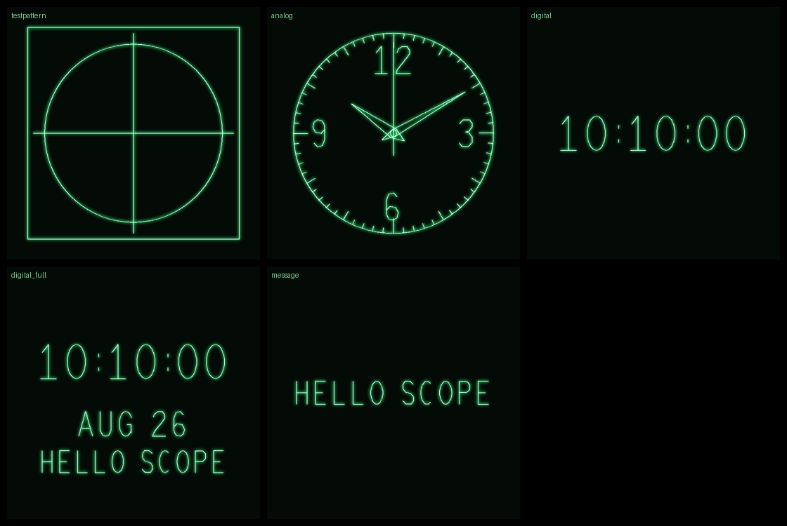

# scope-clock

A clock drawn on an **analog oscilloscope in X-Y mode** - the scope becomes a
vector display and an STM32 streams the beam. Analog face, digital `HH:MM:SS`,
or a WiFi-supplied message. It's a toy: a small demonstration of the
DMA-streamed vector-display trick, done with a near-minimal chip count.



*(regenerate the image with `run.cmd` - see below)*

## The idea

CH1 drives horizontal deflection, CH2 vertical, and a Z input blanks the beam.
A **circular DMA** loops a whole frame of packed `(x, y)` samples to the dual
12-bit DAC at 200 kSa/s; a **second DMA** stream blanks the beam on retrace.
Once running the picture costs **zero CPU** - the MCU only rebuilds the frame
once a second and swaps it tear-free. See `docs/DESIGN.md`.

## Try it now (no hardware)

The host simulator rasterizes each scene exactly as the firmware will and
renders it scope-style, so you can iterate the vectors on a PC.

```powershell
.\run.cmd                       # -> tools\out\*.png, *.svg, contact_sheet.png
.\run.cmd --now                 # current time
.\run.cmd --time 13:37:00 --message "HELLO SCOPE" --show-retrace --dots
.\run.cmd --target f401 --pwm   # Nucleo build, incl. the RC output stage
```

It also prints the per-scene point budget (must stay above the refresh floor).

## Three builds

| | Board | Output stage | Chips |
|---|---|---|---|
| **Minimal** | NUCLEO-G431KB | dual 12-bit DAC, buffered outputs drive the scope directly | **1 + a transistor** |
| **No-purchase** | Nucleo-F401RE | 8-bit PWM pair + RC filters (the F401 has **no DAC**) | 1 + 8 passives |
| **Full** | STM32F4-Discovery + ESP-01 | dual 12-bit DAC, op-amp buffers, Z-blank, WiFi/SNTP | 3 + a transistor |

The vector engine, font, scenes and UART protocol are identical across all
three; only the output backend differs. See `hardware/README.md` for wiring.

## Build the firmware

```powershell
cd firmware\stm32
pio run -e nucleo_g431kb -t upload   # minimal build
pio run -e nucleo_f401re -t upload   # no-purchase build
pio run -e disco_f407vg  -t upload   # full build
```

Flash the ESP-01 (`firmware/esp01/esp01_wifi.ino`) with the Arduino ESP8266
core after setting your WiFi credentials; the web form lives at
`http://scopeclock.local/`.

## Layout

```
tools/        host font + vector engine + preview simulator (Python)
firmware/stm32  STM32 firmware (libopencm3): DAC+DMA streaming, RTC, ESP link
firmware/esp01  ESP-01 WiFi modem: SNTP + web form -> UART
hardware/     schematic notes, BOM, scope hookup
docs/         design + protocol + verification
```

## Status

**Working on hardware.** The NUCLEO-G491RE build was brought up on 2026-08-26
and confirmed on a Keysight InfiniiVision DSOX4034A: the clock renders correctly
and the refresh is stable at ~95 Hz.

Host tooling is verified, and all four targets compile clean. The G431, F401
and F407 targets remain unflashed. See `CLAUDE.md` and `docs/DESIGN.md`.
