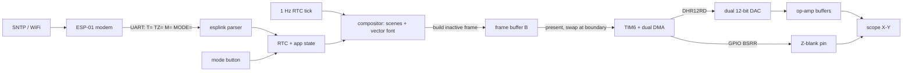

# Scope clock - design

An analog oscilloscope in **X-Y mode** is a vector display: CH1 deflects the
beam horizontally, CH2 vertically, and a Z / intensity input blanks it. Feed it
a stream of `(x, y)` points fast enough and phosphor persistence + the eye fuse
them into a steady picture. This project turns an STM32 + two DACs into that
point source and draws a clock on it - analog face, digital `HH:MM:SS`, or a
WiFi-supplied message.

## The elegant heart: a streamed static frame

One **circular DMA** streams a whole frame of packed samples to the dual DAC at
a fixed sample clock (TIM6). Once running, **the image costs zero CPU** - it
just loops. The CPU only rebuilds the sample buffer when the second changes or
the mode/message updates (~once per second), into a *second* buffer, then swaps
at a frame boundary so the picture never tears.

A second DMA stream, triggered by the same timer, drives the **Z-blank** GPIO
from a parallel array - so beam on/off is aligned with each `(x, y)` sample with
no CPU in the loop.

## How a frame is built

`scene_build()` (`firmware/stm32/src/scenes.c`) issues vector primitives -
`ve_move`, `ve_line`, `ve_circle`, `ve_text`, `ve_dwell` - into the
`vector_engine`. The engine expands each stroke into **evenly spaced**
interpolated samples: equal spacing means the beam dwells equally everywhere, so
brightness is uniform. Where you want a bright node (hand tip, hub) you emit
extra `ve_dwell` samples; on a pen-up jump you emit a few **blanked** samples so
the retrace is dark.

Each sample is stored ready for the hardware:

- `xy[i]` = a `DHR12RD` word - Y in bits 27:16, X in bits 11:0 - so one DMA
  write updates **both** DAC channels synchronously.
- `z[i]` = a GPIO `BSRR` word (set or reset the Z pin) streamed by the second
  DMA.

The **vector font** (`src/font_vec.c`, generated) is a compact Flash table of
single-stroke glyphs - the way a pen plotter draws letters - giving clean text
and full ASCII for messages. It is generated from one source of truth,
`tools/vectorfont.py`, by `tools/gen_font.py`.

## Point budget

`TIM6` runs at `SAMPLE_RATE_HZ` (200 kSa/s). Refresh = rate ÷ samples-per-frame.
With `VE_MAX_POINTS = 4096` the floor is ~49 Hz; every stock scene is well under
budget (host `preview.py` prints the numbers - analog ≈ 2000 pts ≈ 99 Hz,
digital ≈ 580 pts ≈ 346 Hz). `ve_cfg.step` trades brightness (density) against
point count.

## Two output stages, one engine

The streamed-frame idea is independent of how the analog voltage is made, which
is what makes an intermediate build on a Nucleo-F401RE possible at all: **the
F401 has no DAC peripheral** (RM0368 has no DAC chapter, and no TIM6/TIM7
either). So that board synthesises X and Y as PWM duty cycles on TIM3_CH1/CH2,
smoothed by an external two-stage RC low-pass.

Everything above the output stage is shared. `board.h` dispatches to a board
header that supplies the pin map, the budget, `ve_word_t` and `frame_pack()`
(how a beam sample becomes the two words the two DMA streams consume);
`display.h` is the backend interface.

| | G491 (verified) | G431 (minimal) | F407 (full) | F401 (no-purchase) |
|---|---|---|---|---|
| Sample clock | TIM6, 200 kSa/s | TIM6, 125 kSa/s | TIM6, 200 kSa/s | TIM2, 109.4 kSa/s |
| X/Y | dual 12-bit DAC, one `DHR12RD` write | same | same | TIM3 CCR1/CCR2, 8-bit PWM at 328 kHz |
| DMA | ch1+ch2 via DMAMUX (IDs 6, 8) | ch1+ch2 via DMAMUX | Stream5 + Stream1, ch7 | Stream1 + Stream7, ch3, both on TIM2_UP |
| Levels/axis | 4096 | 4096 | 4096 | 257 |
| Z-blank | GPIO `BSRR` by DMA | same | same | none (retrace minimized by ordering) |
| Frame budget | **4096 pts** (96 KB contiguous) | 1536 pts (32 KB SRAM) | 4096 pts | 2560 pts |
| Analog parts | **none** (buffered DAC) + transistor | **none** + transistor | dual op-amp + transistor | 4 resistors + 4 capacitors |

Both axes ride the same trigger in both designs, which is what keeps X and Y
from ever skewing by a sample: on the F407 because one 32-bit word carries both
channels, on the F401 because both DMA streams fire on the same TIM2 update
(RM0368 Table 28 maps TIM2_UP to DMA1 Stream 1 *and* Stream 7).

### The filter is the design

For the PWM build the RC network sets the image quality, and its two failure
modes pull against each other: too fast and the 328 kHz carrier ripples through
and thickens the beam, too slow and the filter cannot follow the beam. The
second one is sneakier than it sounds. A slow filter is still travelling when a
new stroke unblanks, so the beam paints a **tail from wherever it came from** -
in simulation an `H` came out looking like an `A`. The fix is `move_settle`:
hold the beam blanked at the stroke's start for a few samples so the output
settles before it lights. `tools/analog.py` models the loaded network (with the
`R1*C2` interaction term a naive two-independent-poles model misses) and
`preview.py --target f401 --pwm` renders the result, so filter values can be
chosen on a PC rather than by resoldering.

## Host reference (`tools/`)

The Python side is a faithful reference *and* a hardware-free workshop:

| File | Role |
|------|------|
| `vectorfont.py` | the font - single source of truth, semi-procedural (arcs) |
| `vengine.py` | reference rasterizer; mirrors `vector_engine.c` |
| `scenes.py` | reference scenes; mirrors `scenes.c` |
| `preview.py` | renders each scene as a scope-style PNG/SVG + prints the budget |
| `analog.py` | the PWM build's RC output stage: ripple, lag, filtered beam |
| `check_c_engine.py` | compiles the firmware engine with host gcc and diffs it against this reference, per target |
| `gen_font.py` | emits `firmware/stm32/src/font_vec.{c,h}` |

Run `python tools/preview.py` (or `run.cmd`) to regenerate `tools/out/`.

## ESP-01 UART protocol

The ESP-01 is a dumb modem; the STM32 is the single brain. Newline-terminated
lines over USART2 @ 115200 (parsed in `src/esplink.c`):

| Line | Meaning |
|------|---------|
| `T=<utc_epoch>` | set UTC seconds since 1970-01-01 (from SNTP) |
| `TZ=<offset_sec>` | timezone offset in seconds (local = UTC + offset) |
| `M=<text>` | custom message, ≤ 63 chars |
| `MODE=<name>` | `ANALOG` / `DIGITAL` / `MESSAGE` / `TEST` |

The STM32 keeps its own software epoch and self-increments; the ESP just
re-disciplines it (`T=`) every 10 s. Before any sync the clock is not blank or
fake-looking: it starts from `RTC_DEFAULT_EPOCH` (10:10:00, Wed 26 Aug 2026) and
runs, so the board is a working clock from reset and simply jumps when SNTP
arrives.

## Verification

1. **Host:** `python tools/preview.py` - inspect `tools/out/contact_sheet.png`;
   confirm no scene reports `OVER` budget.
2. **DAC/DMA bring-up:** flash, `MODE_TEST` → clean centered box + circle +
   crosshair on the X-Y scope. Verify TIM6 rate with a scope/LA on a toggled
   pin in the TC ISR.
3. **Z-blank:** the retrace between the box and circle must be dark; flip
   `ZBLANK_ACTIVE_HIGH` if not.
4. **Timebase:** seconds advance and the hands/digits update once a second.
5. **WiFi:** ESP-01 joins, `T=` sets the clock, the web form changes message +
   mode live.

See `hardware/README.md` for the electrical side and the full bring-up notes.

Vendor reference kept alongside: `docs/um2505-...-mb1367-....pdf` is ST UM2505,
the STM32G4 Nucleo-64 (MB1367) board manual. Table 16 in it is the authority for
the connector pinout, and Table 11 for the solder bridges (SB6 = LD2 on PA5).

## Status

The NUCLEO-G491RE build is **working on real hardware**, confirmed on a
Keysight InfiniiVision DSOX4034A on 2026-08-26.

Host tooling (font, engine, scenes, preview) runs and is verified visually.
The STM32 firmware is a complete reference build for STM32F407 + libopencm3 and
is **bring-up-pending on hardware** - the register-level DAC/TIM6/DMA/RTC setup
carries explicit checklists (`dac_dma.c`, `rtc.c`) for the details to confirm on
a scope: DMA request mapping (RM0090), TIM6 clock/ARR, and Z polarity.
