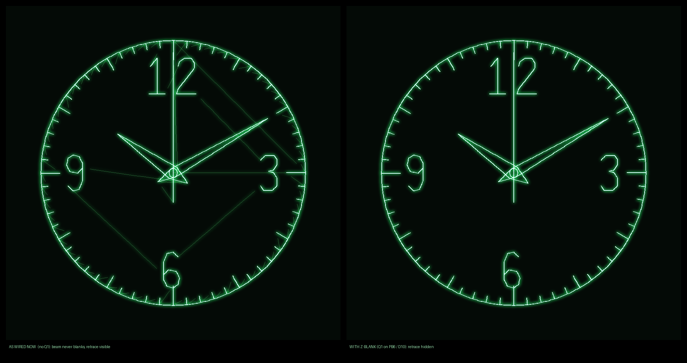

# Scope clock - hardware

Four builds are documented here:

- **[NUCLEO-G491RE (verified working)](#nucleo-g491re-verified-working)** - the
  board on the bench, confirmed running on hardware. Same 1-IC story as the
  G431 but with 4x the SRAM, so it runs the full-quality face.

- **[NUCLEO-G431KB (minimal)](#nucleo-g431kb-minimal-build)** - the smallest and
  cheapest part with the same 1-IC output stage, if 32 KB of SRAM is enough.
- **[Nucleo-F401RE (no-purchase)](#nucleo-f401re-no-purchase-build)** - the
  board already on the bench. No DAC on the part, so X/Y come from a PWM pair
  plus four resistors and four capacitors. Nothing to buy at all.
- **[F407 + ESP-01 (full)](#signal-path)** - true dual 12-bit DAC, op-amp
  buffers, Z-blanking, WiFi.

| | Chips | X/Y quality | Notes |
|---|---|---|---|
| **WeAct G431CBU6** | **1 + Q1** | 12-bit, buffered | DAC pins free (no board mod); 8 MHz HSE crystal; 32 KB SRAM |
| **G491RE** | **1 + Q1** | 12-bit, buffered | **verified on hardware**; full 4096-pt budget |
| G431KB | **1 + Q1** | 12-bit, buffered | 32 KB SRAM caps the frame at 1536 pts |
| F401RE | 1 + 8 passives | 8-bit, RC-smoothed | uses hardware you own |
| F407 + ESP-01 | 3 + Q1 | 12-bit + op-amp | adds WiFi/SNTP |

---

# WeAct Studio STM32G431CBU6 Core Board

Same silicon as the NUCLEO-G431KB, so it shares `dac_dma_g4.c` and the 32 KB
CCM-alias linker script. Verified against the maker's schematic, kept as
`docs/weact-g431cbu6-schematic.pdf`.

| Signal | Pin | Where |
|---|---|---|
| X | PA4 | header P2 |
| Y | PA5 | header P2 |
| Z-blank | PB6 | header P1 (SB3/SB6 unfitted, so it is free) |
| Mode button | PC13 | on-board KEY (SW2) |
| Spare LED | PC6 | on-board blue |

## Why this is the best host so far

- **PA4/PA5 carry nothing else.** The Nucleo-64 hangs LD2 off PA5 and needs SB6
  lifted before the Y axis can be trusted. Here the DAC pins run straight to the
  header, so there is no board modification at all.
- **A real 8 MHz HSE crystal** (X2, XTAL3225, +/-10 ppm). Because the wall clock
  rides on SysTick, the system clock *is* the timekeeping accuracy: the HSI is
  ~1% (about 14 min/day), this crystal is ~10 ppm (about 1 s/day).

## What it costs

- **32 KB SRAM**, so the budget is back to 1536 points and the face keeps only
  its 12 five-minute ticks. The G491's full 4096-point face does not fit.
- **No on-board debugger.** Flash over the P3 SWD header (PA13 SWDIO, PA14
  SWCLK) with an external ST-Link, or via USB DFU holding BOOT0 (SW3, PB8).
- **No USB-serial bridge**, so there is no `T=`/`MODE=` path out of the box. The
  PC13 KEY cycles modes instead; for time-setting, wire a USB-TTL adapter's TX
  to PA10 (USART1_RX). The firmware is receive-only, so that one wire plus
  ground is enough.

The KEY is wired PC13 - 330R - SW2 - 3V3 with no external pull-down, so it is
active HIGH and the firmware enables an internal pull-down. That is the opposite
of both Nucleos, and it is why the pull direction is now a per-board macro
(`BUTTON_PUPD`) rather than something inferred from polarity.

---

# NUCLEO-G491RE (verified working)

The board this project is currently developed against, and the only one so far
confirmed running on real silicon.

STM32G491RE: Cortex-M4F at 170 MHz, 512 KB flash, 112 KB SRAM (96 KB contiguous
SRAM1+SRAM2 plus a 16 KB CCM), DAC1 with two buffered 12-bit channels.

## Wiring

```
  NUCLEO-G491RE
  +------------+
  |  PA4       |--------------------------> scope CH1  (X)   DAC1_OUT1
  |  PA5       |--------------------------> scope CH2  (Y)   DAC1_OUT2  ** SB6 **
  |  PB6       |--[470R]--| Q1 |----------> scope Z / INTENS  (optional)
  |  GND       |--------------------------> probe grounds
  |  PC13  B1  |  built-in button: cycle display mode
  |  USB       |  ST-Link VCP on PA2/PA3 = USART2, 115200
  +------------+
```

### What you should see



The boot frame at 10:10:00, rendered by `tools/preview.py` from the same
geometry the firmware streams. **Left is what this build actually shows as
wired below** (no Q1, so the beam never blanks and the pen-up moves are drawn
faintly); right is the same frame with Z-blanking fitted. Regenerate with:

```
run.cmd --target g491 --time 10:10:00 --date 2026-08-26 --no-zblank
```

If the circle comes out an ellipse the two channels are on different V/div; if
the picture is mirrored or rotated, swap the probes rather than editing the
geometry.

### Where to clip the probes

All verified against **UM2505 Table 16** (in `docs/`), not from memory. Every
Arduino pin is also mirrored on the morpho inner strip, so either works:

| Signal | MCU pin | ARDUINO header (silkscreen) | ST morpho |
|---|---|---|---|
| X | PA4 | **A2** on CN8 | CN7 pin 32 |
| Y | PA5 | **SCK/D13** on CN5 | CN10 pin 11 |
| Z-blank (optional) | PB6 | **PWM/CS/D10** on CN5 | CN10 pin 17 |
| Ground | - | either **GND** on the CN6 power header | CN7 8/19/20/22, CN10 9/20 |

There is also an **AGND** on CN10 pin 32 if you would rather ground the probes
in the analog domain.

No op-amp: DAC1's channels have built-in rail-to-rail output buffers that drive
the scope inputs directly. Q1 (a 2N7000, or a 2N3904 with the 470 R into the
base) is only needed for Z-blanking; without it the clock still draws, the
retrace just is not hidden.

## ** Open solder bridge SB6 before trusting the Y axis **

On the MB1367 Nucleo-64, **PA5 also drives the user LED LD2** (Arduino D13)
through solder bridge SB6 and a transistor. That is a nonlinear load sitting on
the Y deflection output. UM2505 is explicit about what SB6 does:

> SB6 **ON**: user LED driven by PA5 (ARD_D13).  SB6 **OFF**: user LED not driven.

So SB6 gates only the LED branch - opening it leaves PA5 fully connected to D13
and to the morpho. It is a 0 ohm jumper, so it lifts easily. You lose LD2 as an
indicator, which this firmware never uses.

Self-check after lifting it: **LD2 should go completely dark while the Y trace
is unchanged.** If the trace disappears too, the wrong link came off.

A dimly lit LD2 before the mod is expected and is actually a good sign: PA5 is
carrying a 12-bit analog voltage sweeping over the frame, and the LED's
transistor driver conducts whenever that voltage is above its threshold, so the
brightness is a time-average of the Y deflection. It is not a PWM duty cycle.

The G431KB Nucleo-32 does not have this problem (its LD2 is on PB8).

## Driving a Keysight InfiniiVision (DSO, not a CRT)

Measured against a **DSOX4034A**; the same applies to the 2000/3000/4000
X-Series. Reference: Keysight *InfiniiVision 4000 X-Series Oscilloscopes User's
Guide* (54709-97072), pages 71 and 74 - free from keysight.com, not mirrored
here.

**It has a real Z input, and no transistor is needed.** In XY mode the scope
reassigns its inputs (UG p71, p74):

| Scope input | Signal | From |
|---|---|---|
| Channel 1 | X | PA4 (`A2`) |
| Channel 2 | Y | PA5 (`D13`) |
| **EXT TRIG IN** | **Z (blanking)** | PB6 (`D10`) **direct, no Q1** |

EXT TRIG IN is a 1 Mohm logic-level input switching at 1.4 V (300 Vrms abs max),
so a 3.3 V GPIO drives it directly at about 3 uA. Q1 exists only for analog CRTs
whose intensity input needs a different level. On this scope the whole clock is
**one IC and four wires**.

Polarity is the opposite of a typical CRT, and the manual is explicit:

> "When Z is low (<1.4 V), Y versus X is displayed; when Z is high (>1.4 V), the
> trace is turned off."

So beam-ON must be LOW. `board_g491.h` therefore sets `ZBLANK_ACTIVE_HIGH 0`.
If you move to a CRT that brightens on a positive Z, flip it back to 1.

### Scope setup

For the SCPI sequence Claude uses to drive this scope on the HITL bench, see
the "Bench / HITL" section of `CLAUDE.md` at the repo root.

1. `[Horiz]` -> **Time Mode** -> **XY** (UG p71).
2. Channels 1 and 2 **DC coupled**, equal V/div (~0.5 V/div for the 0-3.3 V swing),
   and use the position knobs to bring mid-scale to screen centre.
3. Turn on **infinite persistence**. This matters: a DSO does not have a
   phosphor, it plots sampled points, so persistence is what accumulates the
   frame into a picture instead of a sparse scatter.
4. Set the acquisition window to cover at least one whole frame. The analog
   face is 2097 points at 200 kSa/s = **10.5 ms**, so roughly 1-2 ms/div.
   Too short a window and you will see only an arc of the clock at a time.

## Setting the time

The ST-Link VCP is USART2, the same UART the ESP-01 protocol uses, so the clock
can be driven from a terminal with no WiFi hardware at all. At 115200:

```
TZ=-25200         local offset in seconds
T=1787716809      UTC epoch seconds
MODE=ANALOG       ANALOG | DIGITAL | MESSAGE | TEST
M=HELLO SCOPE     custom message
```

**On power-up the clock starts at 10:10:00 on Wed 26 Aug 2026 and runs from
there** (`RTC_DEFAULT_EPOCH` in `src/rtc.h`) - the time watches are traditionally
photographed at, because the hands sit symmetrically. A `T=` simply replaces it.
There is no "waiting for time" screen, so `MODE=TEST` is honoured immediately,
which is what you want while framing the picture.

## Verifying without a scope

The whole signal path can be confirmed over SWD, which is how this build was
brought up. With OpenOCD attached:

| Read | Address | Expect |
|---|---|---|
| `DAC1_CR` | `0x50000800` | `0x001F101F` (both channels enabled, TIM6 trigger, ch1 DMA) |
| TIM6 `ARR` | `0x4000102C` | `849` = 200 kSa/s from 170 MHz |
| `DMA1_CNDTR` | `0x4002000C` | **counting down** - if frozen, the DAC is not being triggered |
| `DAC1_DHR12RD` | `0x50000820` | changing; Y in bits 27:16, X in bits 11:0 |
| `HFSR` / `CFSR` | `0xE000ED2C` / `0xE000ED28` | both zero |

To decode a sample: `world = 2*code/4095 - 1`. A point on the face ring should
come out at radius 0.90.

---

# NUCLEO-G431KB (minimal build)

STM32G431KB: Cortex-M4F at 170 MHz, 128 KB flash, **32 KB SRAM**, DAC1 with two
12-bit channels, CORDIC, DMAMUX, TIM6.

The reason this is the minimal-chip answer: **DAC1's channels have built-in
rail-to-rail output buffers that drive an external load directly**, so the dual
op-amp the F407 build needs disappears. What is left is the MCU and one
transistor for Z-blanking.

## Wiring

```
  NUCLEO-G431KB
  ┌────────────┐
  │  PA4       ├──────────────────────────► scope CH1  (X)   DAC1_OUT1
  │  PA5       ├──────────────────────────► scope CH2  (Y)   DAC1_OUT2
  │  PB6       ├──[470R]──►│ Q1 ├─────────► scope Z / INTENS
  │  GND       ├──────────────────────────► probe grounds
  │  USB       │  ST-Link VCP on PA2/PA3 = USART2: time + mode
  └────────────┘
```

Q1 is a 2N7000 (or 2N3904 with the 470 R into the base). Omit it and the clock
still works; the retrace just is not hidden.

**No user button.** Nucleo-32 has only RESET, so the display mode is changed
over the virtual COM port with `MODE=ANALOG` / `DIGITAL` / `MESSAGE` / `TEST`
(same protocol as the ESP-01, see the F401 section below).

## The SRAM constraint

This is the one real design pressure on this part, and it is worth
understanding before changing any scene:

A double-buffered frame costs **16 bytes per point** (2 frames x 2 words x 4
bytes). The F407's 4096-point budget would therefore need 64 KB, which is twice
this chip's entire memory. So:

- `VE_MAX_POINTS` is **1536** (24 KB of the 32 KB), leaving ~8 KB for stack and
  globals.
- The analog face drops its 48 in-between minute ticks and keeps the 12
  five-minute ticks (`SCENE_MINUTE_TICKS 0`), which saves ~380 points.
- The face then lands at **1445 points, 94% of budget** - deterministic, but
  thin. Adding geometry to the analog scene on this target needs a re-check
  with `tools/check_c_engine.py`.

Refresh is not the constraint: 1445 points at 125 kSa/s is **86 Hz**.

## Known limitation: DAC output near the rails

The STM32 DAC's output buffer cannot reach either supply rail; it saturates
roughly 0.2 V from each. Full-scale codes therefore compress slightly, so the
extreme edge of the picture is a little nonlinear. In practice the scenes stay
inside a 0.90-0.95 radius and this is barely visible, but if the test pattern's
outer box looks flattened on one side, that is what you are seeing. Cures, in
order of preference: use the scope's V/div and position to frame the linear
part, or reduce the scene radius constant. Do not "fix" it by rotating or
mirroring the geometry.

## Adding WiFi later

Nothing about this build precludes the ESP-01: it talks over USART2, which is
currently connected to the ST-Link VCP. Wire the ESP-01 to PA2/PA3 instead and
the same firmware accepts the same `T=`/`TZ=`/`M=`/`MODE=` lines. That makes it
2 ICs with SNTP and a web form.

---

# Nucleo-F401RE (no-purchase build)

**The STM32F401 has no DAC.** RM0368 documents TIM1, TIM2-5 and TIM9-11 and
contains no DAC chapter at all (nor TIM6/TIM7); ST's parametric table lists
"D/A converters: -". PA4/PA5 are DAC pins *on the F407*, but on the F401 they
are ordinary GPIO/ADC pins. So this build synthesises the deflection voltages
with two PWM channels on one timer, each smoothed by a two-stage RC low-pass.

## Wiring

```
  Nucleo-F401RE                     2-pole RC low-pass
  ┌────────────┐
  │  PA6 (D12) ├──[1k]──┬──[4k7]──┬────────► scope CH1  (X)
  │  TIM3_CH1  │       4n7        1n
  │            │        │          │
  │            │       GND        GND
  │            │
  │  PA7 (D11) ├──[1k]──┬──[4k7]──┬────────► scope CH2  (Y)
  │  TIM3_CH2  │       4n7        1n
  │            │        │          │
  │            │       GND        GND
  │            │
  │  GND       ├───────────────────────────► both probe grounds
  │  PC13  B1  │  built-in button: cycle display mode
  │  USB       │  ST-Link VCP = USART2: set time / mode from a terminal
  └────────────┘
```

Both axes must use **matched** component values, or the picture comes out
stretched on one axis and the test circle turns into an ellipse.

## Why these values

The filter is the whole ball game. Too fast and the 328 kHz carrier ripples
through and thickens the beam; too slow and the filter cannot follow the beam,
so corners round off and each stroke drags a visible tail from wherever the
beam came from. `tools/preview.py --target f401 --pwm` simulates the actual
loaded network (including the R1*C2 interaction term) so you can see both
effects before soldering:

| Values | Ripple | Lag | Verdict |
|---|---|---|---|
| 1k/4n7 + 4k7/1n | 44 mVpp (1.3% FS) | 10.4 µs | **stock** - best balance |
| 1k/10n + 4k7/2n2 | 10 mVpp (0.3% FS) | 22.5 µs | cleaner beam, but the long lag needs so many blanked settling samples per stroke that it costs refresh rate |
| 1k/1n + 4k7/220p | ~1 Vpp | ~1 µs | far too fuzzy, carrier gets through |

Substitutions are fine: keep each stage near 20-40 kHz and keep R2 several
times R1 so the second stage does not load the first. Check any pair with
`--r1/--c1/--r2/--c2` before committing.

The firmware compensates for whatever lag remains by holding the beam blanked
for `VE_DEFAULT_MOVE_SETTLE` samples at the start of every stroke. If you fit
a much slower filter, raise that number or the letters grow tails.

## What to expect

- 257 levels per axis (8-bit PWM) instead of 4096, so diagonals are slightly
  stepped on close inspection.
- ~59 Hz refresh on the analog face, ~235 Hz on the digital one.
- **No Z-blanking** in this build (it needs a transistor into the scope's Z
  input). Retrace is minimized by stroke ordering, and blanked moves still get
  drawn faintly. Use `--show-retrace` in the preview to see what is not hidden.

## Scope setup

Same as the final build below: X-Y mode, both channels DC coupled, equal V/div,
center with the position knobs. Run `MODE=TEST` first and expect a centered
square + circle + crosshair.

## Setting the time

No ESP-01 yet, but `USART2` is wired to the ST-Link's virtual COM port, which is
the same UART the ESP-01 protocol uses. Open the Nucleo's COM port at 115200
and type the same lines the ESP would send:

```
T=1789200000      set UTC epoch seconds
TZ=-14400         local offset (EDT)
MODE=ANALOG       ANALOG | DIGITAL | MESSAGE | TEST
M=HELLO SCOPE     custom message
```

`USE_LSI` is set for this env because the Nucleo's 32.768 kHz crystal is not
populated, so the RTC will drift; re-send `T=` when it bothers you.

---

# F407 + ESP-01 (full build)

Minimal-chip X-Y vector clock. The STM32 does everything digital; the analog
side is one dual op-amp (X/Y buffers), one transistor (Z-blank), and a
regulator.

## Signal path

```
                       +3V3                         ±(opt)  to scope
                        │                             │     ┌──────────┐
  ┌───────────┐  PA4 ───┼──[DAC1_OUT1 X]──► ½ U3 ─Rs─┼─────► CH1 (X)   │
  │  STM32F4  │  PA5 ───┼──[DAC1_OUT2 Y]──► ½ U3 ─Rs─┼─────► CH2 (Y)   │
  │  (U1)     │         │      op-amp buffer / level-shift              │
  │           │  PE2 ───┼──[Z-BLANK]──470Ω──►│ Q1 ├──────────► Z / INTENS
  │           │  PA2 ───┼──► ESP-01 RX                          │       │
  │           │  PA3 ◄──┼─── ESP-01 TX (U2)                     └───────┘
  │ LSE 32768 │  PA0 ◄── user button (mode)
  └───────────┘
   USB 5V ─► AMS1117-3V3 (U4) ─► +3V3 (U1, U2, U3)
```

- **U3 dual op-amp** - one channel per axis. Buffers the DAC (kΩ-ish source) to
  a low impedance that can drive coax into the scope, and optionally
  scales/level-shifts. Use a rail-to-rail, ≥10 MHz part (OPA2350, MCP6L92,
  TLV2372). `Rs` ≈ 50-100 Ω in series damps the cable.
- **Reconstruction (optional)** - a light RC (e.g. 220 Ω + 1 nF, ~700 kHz)
  right after each DAC softens the sample-step edges without smearing vectors
  at our ≤200 kSa/s point rate.
- **Q1 Z-blank** - `PE2` → 470 Ω → gate of a 2N7000 (or base of a 2N3904 with
  470 Ω). It switches the scope's Z / intensity input so blanked retrace moves
  are dark. **Polarity varies by scope** (some brighten on positive drive,
  some blank): set `ZBLANK_ACTIVE_HIGH` in `firmware/stm32/src/board.h` to
  match, and confirm with the `MODE_TEST` pattern (its retrace must be dark).

## Output coupling / centering

The DAC + single-supply buffer swings ~0-3 V. Two ways to sit it on the scope:

1. **Simplest (single +3V3 rail):** DC-couple; use the scope's X/Y **position**
   knobs to move the origin to screen center and **V/div** to scale. No negative
   supply, U3 is just two buffers.
2. **True bipolar (±):** run U3 from a ± supply and wire it as a difference amp,
   `Vout = G·(Vdac − Vmid)` with `Vmid = 1.65 V`, giving an output centered on
   0 V. Needs a negative rail (e.g. an ICL7660 charge pump, +1 small IC).

Start with (1) for bring-up; move to (2) only if you want it plug-and-play on a
fixed scope.

## Timekeeping

- **LSE 32.768 kHz** crystal on `PC14/PC15` clocks the RTC (accurate 1 Hz).
  **The stock STM32F4-Discovery does not populate this crystal** - fit it, or
  build `-DUSE_LSI` and lean on frequent SNTP (the internal RC drifts).
- No VBAT coin cell in this build (by design): a power cycle re-acquires time
  from SNTP when the ESP-01 reconnects. A coin-cell footprint on VBAT is a
  cheap future upgrade for offline hold-over.

## Bill of materials (core)

| Ref | Part | Notes |
|-----|------|-------|
| U1  | STM32F407VG (or any dual-12-bit-DAC STM32; G431 for a lean board) | the brain; DAC+DMA+RTC |
| U2  | ESP-01 (ESP8266) | WiFi + SNTP + web form |
| U3  | Dual RRIO op-amp, ≥10 MHz (OPA2350 / MCP6L92 / TLV2372) | X & Y buffers |
| Q1  | 2N7000 (or 2N3904 + 470 Ω) | Z-axis blanking switch |
| U4  | AMS1117-3.3 (≥500 mA) | 5 V→3.3 V; ESP-01 peaks ~350 mA |
| Y1  | 32.768 kHz crystal + 2×~7 pF | RTC LSE |
| -   | 8 MHz HSE crystal | on the Discovery already |
| -   | 2×Rs 68 Ω, 2×(220 Ω+1 nF), 470 Ω, 0.1 µF decoupling, 10 µF + 470 µF bulk (ESP) | passives |

**Chip count: 3 ICs (U1-U3) + regulator + one transistor.** The whole digital
clock is essentially one MCU; the analog side is one op-amp package and a FET.

## Scope setup

1. Display mode → **X-Y** (CH1 = X/horizontal, CH2 = Y/vertical).
2. Both channels **DC** coupled; equal **V/div**; center with position knobs.
3. If available, wire **Z / intensity** input to Q1 for blanking; otherwise
   leave Q1 off and accept faint retrace (the firmware still minimizes it).
4. Load `MODE_TEST` first: a centered square + circle + crosshair. Square not
   square → equalize V/div; axes swapped/mirrored → fix op-amp polarity or the
   `pack_xy()` mapping, not the geometry.
